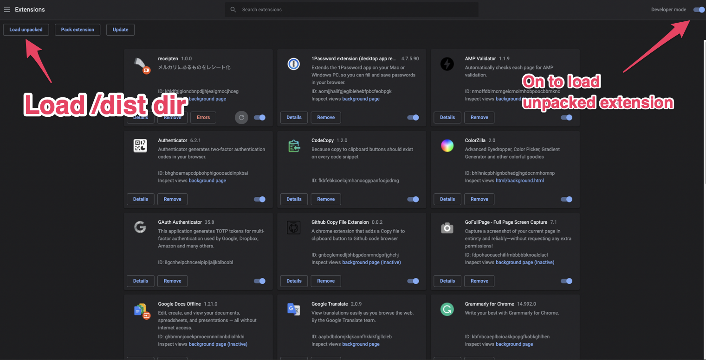

# receipten-extension

Chrome Extension by ReScript.(only popup)

## how to install

build chrome extension

### local

build a extension.

```sh
npm install

# rescript build to generate *.bs.js
npm run build

# build for chrome extension via webpack
npm run gen
```

open chrome extension manager and set dist/ dir.



### prd

TBD(now doing examination)

## how to use

1. install extension
2. go to [mercari](https://www.mercari.com/jp/)
3. click a item
4. open extension
5. send request to create receipt
